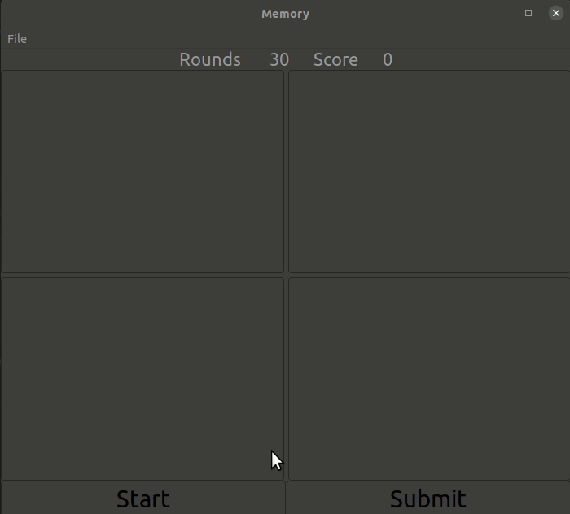

# SpatialMemory

A simple adaptive spatial memory game. 




# Installation 

1. Install [Julia](https://julialang.org/downloads/) 1.7 or higher.

2. Open Julia once installed. 

3. Enter the following into the Julia command line to install SpatialMemory.jl

```julia
] add https://github.com/itsdfish/SpatialMemory.jl
```

# Play

1. Enter the following commands into the Julia command line to load and start the game:

```julia
using SpatialMemory 
start()
```

2. Click the "start" button to begin each trial.
3. Try to reproduce the pattern by clicking the buttons
4. Click "submit" to enter your answer. 
5. Repeat 2-4